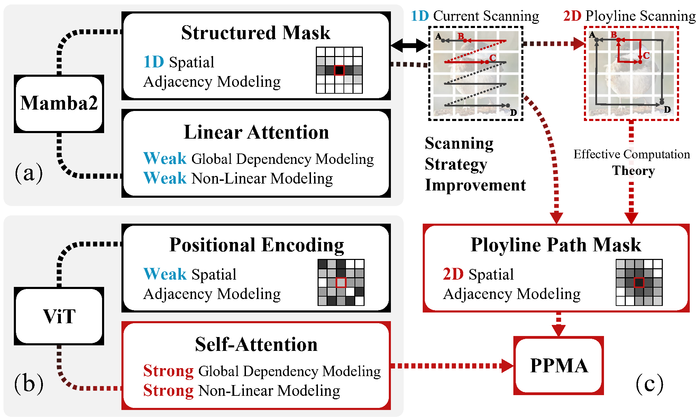
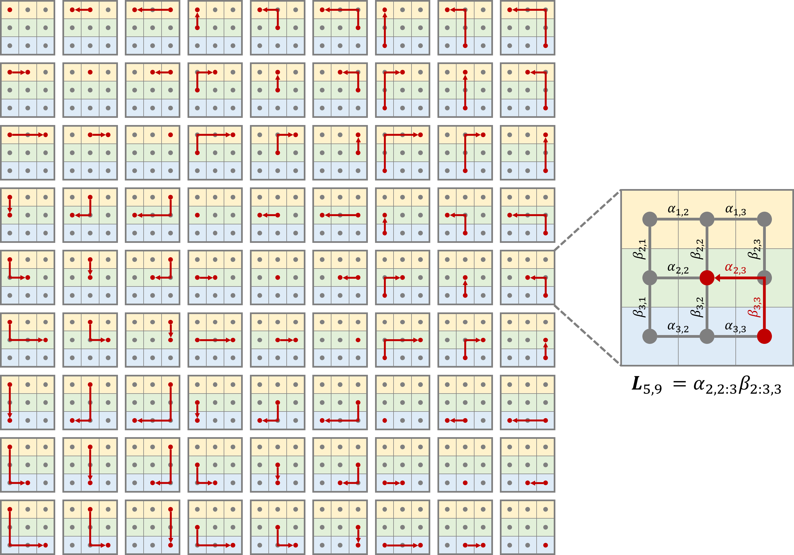
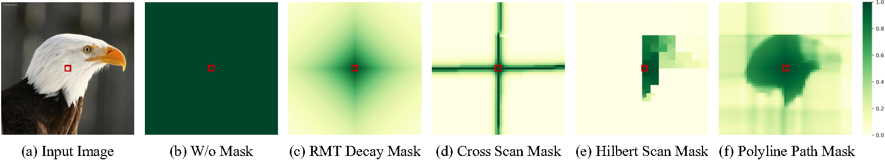
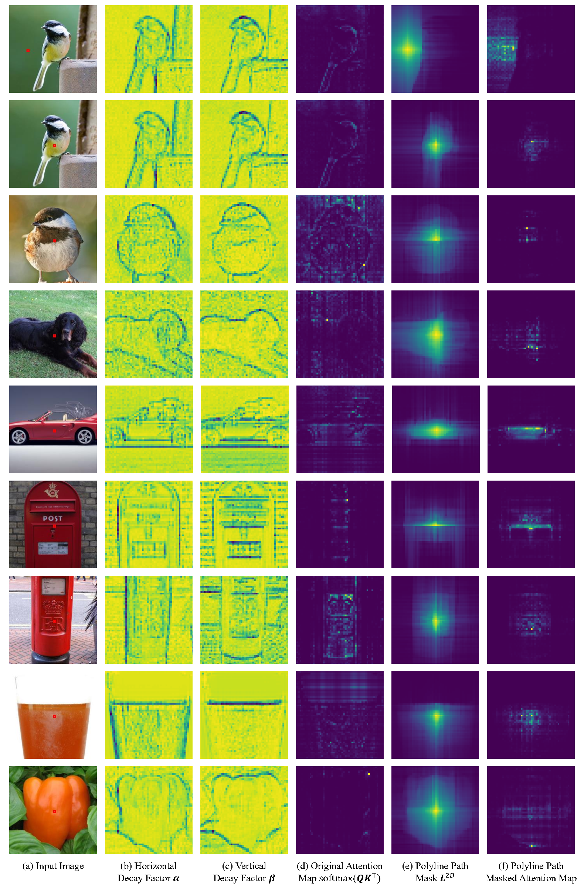

# Polyline Path Masked Attention for Vision Transformer

✨Official codes for **Polyline Path Masked Attention for Vision Transformer (PPMA)** (NeurIPS 2025 spotlight)

**🤗 Don’t hesitate to give me a ⭐️, if you are interested in this project!**

[](https://arxiv.org/pdf/2506.15940) [](https://huggingface.co/ZhongchenZhao/PPMA/tree/main/checkpoints) 
[](https://github.com/zhongchenzhao/PPMA/blob/main/Slide_From%20Mamba%20to%20PPMA%20(PPT).pdf)

[](https://github.com/zhongchenzhao/PPMA/blob/main/2025NeurIPS_PPMA_poster.png)


## 📌 Updates
* ***2025.09.18*** Our paper is accepted by NeurIPS 2025 spotlight (top 3%)! 🎉🎉
* ***2025.10.16*** We have uploaded a [poster](https://github.com/zhongchenzhao/PPMA/blob/main/2025NeurIPS_PPMA_poster.png) for the NeurIPS 2025 conference.
* ***2025.09.22*** We have uploaded a detailed [PPT](https://github.com/zhongchenzhao/PPMA/blob/main/Slide_From%20Mamba%20to%20PPMA%20(PPT).pdf) explaining the principles of Mamba and our work!
* ***2025.06.19*** We have submitted the preprint of our paper to [Arxiv](https://arxiv.org/pdf/2506.15940)!
* ***2025.06.15*** We have released the complete pre-trained model weights to [Hugging Face](https://huggingface.co/ZhongchenZhao/PPMA/tree/main/checkpoints) !
*  ***2025.06.12*** We have released the complete training and inference codes and [training logs](./training_logs)!


## 💡 Getting started

**TL;DR:** **We adapt Mamba2's structured mask to 2D scanning and integrates it into the self-attention mechanism of ViTs as an explicit positional encoding.**





**An illustration of the 2D polyline path scanning on a 3×3 grid.**




## 🧠 Abstract

**Global dependency modeling** and **spatial position modeling** are two core issues of the foundational architecture design in current deep learning frameworks. Recently, Vision Transformers (ViTs) have achieved remarkable success in computer vision, leveraging the powerful global dependency modeling capability of the self-attention mechanism. 	Furthermore, Mamba2 has demonstrated its significant potential in natural language processing tasks by explicitly modeling the spatial adjacency prior through the structured mask. 

In this paper, we propose **Polyline Path Masked Attention** (**PPMA**) that integrates the self-attention mechanism of ViTs with an enhanced structured mask of Mamba2, harnessing the complementary strengths of both architectures. Specifically, we first ameliorate the traditional structured mask of Mamba2 by introducing a **2D polyline path scanning strategy** and derive its corresponding structured mask, polyline path mask, which better preserves the adjacency relationships among image tokens. Notably, we conduct a thorough theoretical analysis on the structural characteristics of the proposed polyline path mask and design an efficient algorithm for the computation of the polyline path mask. Next, we embed the polyline path mask into the self-attention mechanism of ViTs, enabling explicit modeling of spatial adjacency prior. 

Extensive experiments on standard benchmarks, including image classification, object detection, and segmentation, demonstrate that our model outperforms previous state-of-the-art approaches based on both state-space models and Transformers. For example, our proposed PPMA-T/S/B models achieve **48.7%**/**51.1%**/**52.3%** mIoU on the ADE20K semantic segmentation task, surpassing RMT-T/S/B by **0.7%**/**1.3%**/**0.3%**, respectively.


## 📊 Results

[](https://huggingface.co/ZhongchenZhao/PPMA/tree/main/checkpoints)

- #### Image Classification Results on ImageNet-1K 224x224

|   Model    | #Params | FLOPs |  Acc  |                         Training log                         |                          Checkpoint                          |
| :--------: | :-----: | :---: | :---: | :----------------------------------------------------------: | :----------------------------------------------------------: |
| PPMA-Tiny  |   14M   | 2.7G  | 82.6% | [PPMA-Tiny](./training_logs/classification/ppma_tiny_log.txt) | [PPMA-Tiny](https://huggingface.co/ZhongchenZhao/PPMA/blob/main/checkpoints/classification/PPMA_T_202502251000/best.pth) |
| PPMA-Small |   27M   | 4.9G  | 84.2% | [PPMA-Small](./training_logs/classification/ppma_small_log.txt) | [PPMA-Small](https://huggingface.co/ZhongchenZhao/PPMA/blob/main/checkpoints/classification/PPMA_S_202504021000/best.pth) |
| PPMA-Base  |   54M   | 10.6G | 85.0% | [PPMA-Base](./training_logs/classification/ppma_base_log.txt) | [PPMA-Base](https://huggingface.co/ZhongchenZhao/PPMA/blob/main/checkpoints/classification/PPMA_B_202504101400/best.pth) |


- #### Object Detection and Instance Segmentation Results on COCO with Mask R-CNN Method (1× schedule)

|  Backbone  |                       Pretrained Model                       | #Params | FLOPs | box mAP | mask mAP |                            Config                            |                         Training log                         |                          Checkpoint                          |
| :--------: | :----------------------------------------------------------: | :-----: | :---: | :-----: | :------: | :----------------------------------------------------------: | :----------------------------------------------------------: | :----------------------------------------------------------: |
| PPMA-Tiny  | [PPMA-Tiny](https://huggingface.co/ZhongchenZhao/PPMA/blob/main/checkpoints/classification/PPMA_T_202502251000/best.pth) |   33M   | 218G  |  47.1   |   42.4   | [PPMA-Tiny](./detection/configs/mask_rcnn_ppma_tiny_fpn_1x_coco.py) | [PPMA-Tiny](./training_logs/detection/mask_rcnn_ppma_tiny_fpn_1x_coco.log) | [PPMA-Tiny](https://huggingface.co/ZhongchenZhao/PPMA/blob/main/checkpoints/detection/mask_rcnn_ppma_tiny_fpn_1x_coco/epoch_12.pth) |
| PPMA-Small | [PPMA-Small](https://huggingface.co/ZhongchenZhao/PPMA/blob/main/checkpoints/classification/PPMA_S_202504021000/best.pth) |   46M   | 263G  |  49.2   |   43.8   | [PPMA-Small](./detection/configs/mask_rcnn_ppma_small_fpn_1x_coco.py) | [PPMA-Small](./training_logs/detection/mask_rcnn_ppma_small_fpn_1x_coco.log) | [PPMA-Small](https://huggingface.co/ZhongchenZhao/PPMA/blob/main/checkpoints/detection/mask_rcnn_ppma_small_fpn_1x_coco/epoch_12.pth) |
| PPMA-Base  | [PPMA-Base](https://huggingface.co/ZhongchenZhao/PPMA/blob/main/checkpoints/classification/PPMA_B_202504101400/best.pth) |   73M   | 374G  |  51.1   |   45.5   | [PPMA-Base](./detection/configs/mask_rcnn_ppma_base_fpn_1x_coco.py) | [PPMA-Base](./training_logs/detection/mask_rcnn_ppma_base_fpn_1x_coco.log) | [PPMA-Base](https://huggingface.co/ZhongchenZhao/PPMA/blob/main/checkpoints/detection/mask_rcnn_ppma_base_fpn_1x_coco/epoch_12.pth) |


- #### Semantic Segmentation Results on ADE20K with UPerNet Method (batch size=16)

|  Backbone  |                       Pretrained Model                       | Input Size | #Params | FLOPs | mIoU (SS) | mIoU (MS) |                            Config                            |                         Training log                         |                          Checkpoint                          |
| :--------: | :----------------------------------------------------------: | :--------: | :-----: | :---: | :-------: | :-------: | :----------------------------------------------------------: | :----------------------------------------------------------: | :----------------------------------------------------------: |
| PPMA-Tiny  | [PPMA-Tiny](https://huggingface.co/ZhongchenZhao/PPMA/blob/main/checkpoints/classification/PPMA_T_202502251000/best.pth) |  512×512   |   43M   | 983G  |   48.7    |   49.1    | [PPMA-Tiny](./segmentation/configs/upernet_ppma_tiny_512x512_160k_ade20k_ss.py) | [PPMA-Tiny](./training_logs/segmentation/upernet_ppma_tiny_512x512_160k_ade20k_ss.log) | [PPMA-Tiny](https://huggingface.co/ZhongchenZhao/PPMA/blob/main/checkpoints/segmentation/upernet_ppma_tiny_512x512_160k_ade20k_ss/iter_160000.pth) |
| PPMA-Small | [PPMA-Small](https://huggingface.co/ZhongchenZhao/PPMA/blob/main/checkpoints/classification/PPMA_S_202504021000/best.pth) |  512×512   |   56M   | 984G  |   51.1    |   52.0    | [PPMA-Small](./segmentation/configs/upernet_ppma_small_512x512_160k_ade20k_ss.py) | [PPMA-Small](./training_logs/segmentation/upernet_ppma_small_512x512_160k_ade20k_ss.log) | [PPMA-Small](https://huggingface.co/ZhongchenZhao/PPMA/blob/main/checkpoints/segmentation/upernet_ppma_small_512x512_160k_ade20k_ss/iter_160000.pth) |
| PPMA-Base  | [PPMA-Base](https://huggingface.co/ZhongchenZhao/PPMA/blob/main/checkpoints/classification/PPMA_B_202504101400/best.pth) |  512×512   |   83M   | 1137G |   52.3    |   53.0    | [PPMA-Base](./segmentation/configs/upernet_ppma_base_512x512_160k_ade20k_ss.py) | [PPMA-Base](./training_logs/segmentation/upernet_ppma_base_512x512_160k_ade20k_ss.log) | [PPMA-Base](https://huggingface.co/ZhongchenZhao/PPMA/blob/main/checkpoints/segmentation/upernet_ppma_base_512x512_160k_ade20k_ss/iter_160000.pth) |


- #### Semantic Segmentation Results on Cityscapes with UPerNet Method (batch size=8)

|  Backbone  |                       Pretrained Model                       | Input Size | #Params | FLOPs | mIoU (SS) | mIoU (MS) |                            Config                            |                         Training log                         |                          Checkpoint                          |
| :--------: | :----------------------------------------------------------: | :--------: | :-----: | :---: | :-------: | :-------: | :----------------------------------------------------------: | :----------------------------------------------------------: | :----------------------------------------------------------: |
| PPMA-Tiny  | [PPMA-Tiny](https://huggingface.co/ZhongchenZhao/PPMA/blob/main/checkpoints/classification/PPMA_T_202502251000/best.pth) | 1024×1024  |   43M   | 983G  |   82.7    |   83.5    | [PPMA-Tiny](./segmentation/configs/cityscapes/upernet_ppma_tiny_1024x1024_160k_cityscapes_ss.py) | [PPMA-Tiny](./training_logs/segmentation/upernet_ppma_tiny_1024x1024_160k_cityscapes_ss.log) | [PPMA-Tiny](https://huggingface.co/ZhongchenZhao/PPMA/blob/main/checkpoints/segmentation/upernet_ppma_tiny_1024x1024_160k_cityscapes_ss/iter_160000.pth) |
| PPMA-Small | [PPMA-Small](https://huggingface.co/ZhongchenZhao/PPMA/blob/main/checkpoints/classification/PPMA_S_202504021000/best.pth) | 1024×1024  |   56M   | 984G  |   83.7    |   84.0    | [PPMA-Small](./segmentation/configs/cityscapes/upernet_ppma_small_1024x1024_160k_cityscapes_ss.py) | [PPMA-Small](./training_logs/segmentation/upernet_ppma_small_1024x1024_160k_cityscapes_ss.log) | [PPMA-Small](https://huggingface.co/ZhongchenZhao/PPMA/blob/main/checkpoints/segmentation/upernet_ppma_small_1024x1024_160k_cityscapes_ss/iter_160000.pth) |
| PPMA-Base  | [PPMA-Base](https://huggingface.co/ZhongchenZhao/PPMA/blob/main/checkpoints/classification/PPMA_B_202504101400/best.pth) | 1024×1024  |   83M   | 1137G |   83.9    |   84.3    | [PPMA-Base](./segmentation/configs/cityscapes/upernet_ppma_base_1024x1024_160k_cityscapes_ss.py) | [PPMA-Base](./training_logs/segmentation/upernet_ppma_base_1024x1024_160k_cityscapes_ss.log) | [PPMA-Base](https://huggingface.co/ZhongchenZhao/PPMA/blob/main/checkpoints/segmentation/upernet_ppma_base_1024x1024_160k_cityscapes_ss/iter_160000.pth) |


- #### Mask Visualization




- #### Masked Attention Visualization




## 🚀 Quick Start

#### 1. Requirements

```
conda create -n ppma python=3.8.20 -y
conda activate ppma
chmod +x install_requirements.sh 
./install_requirements.sh 
```


#### 2. Data Preparation

* ImageNet is an image database organized according to the WordNet hierarchy. Download and extract ImageNet train and val images from http://image-net.org/. Organize the data into the following directory structure:

  ```
  imagenet/
  ├── train/
  │   ├── n01440764/  (Example synset ID)
  │   │   ├── image1.JPEG
  │   │   ├── image2.JPEG
  │   │   └── ...
  │   ├── n01443537/  (Another synset ID)
  │   │   └── ...
  │   └── ...
  └── val/
      ├── n01440764/  (Example synset ID)
      │   ├── image1.JPEG
      │   └── ...
      └── ...
  ```

* COCO is a large-scale object detection, segmentation, and captioning dataset. Please visit http://cocodataset.org/ for more information, including for the data, paper, and tutorials. [COCO API](https://github.com/cocodataset/cocoapi) also provides a concise and efficient way to process the data.

* ADE20K is composed of more than 27K images from the SUN and Places databases. Please visit https://ade20k.csail.mit.edu/ for more information and see the [GitHub Repository](https://github.com/CSAILVision/ADE20K) for an overview of how to access and explore ADE20K.


#### 3. Training on ImageNet-1K

```
cd classification/

# PPMA-Tiny
torchrun --nproc_per_node=8 --master_port=29501 main.py --warmup_epochs 5 --model PPMAViT_T --data_path <path-to-imagenet> --num_workers 16 --batch_size 128 --drop_path 0.05 --epoch 300 --dist_eval --output_dir ./exp/PPMAViT_T_202505010000

# PPMA-Small
torchrun --nproc_per_node=8 --master_port=29501 main.py --warmup_epochs 5 --model PPMAViT_S --data_path <path-to-imagenet> --num_workers 16 --batch_size 128 --drop_path 0.05 --epoch 300 --dist_eval --output_dir ./exp/PPMAViT_S_202505010000

# PPMA-Base
torchrun --nproc_per_node=8 --master_port=29501 main.py --warmup_epochs 5 --model PPMAViT_B --data_path <path-to-imagenet> --num_workers 16 --batch_size 128 --drop_path 0.05 --epoch 300 --dist_eval --output_dir ./exp/PPMAViT_B_202505010000
```


#### 4. Training on COCO2017


change <data_root> in `detection/configs/_base_/datasets/coco_instance.py`


```
cd detection/

# 1x schedule
bash dist_train.sh ./configs/mask_rcnn_ppma_tiny_fpn_1x_coco.py 8
bash dist_train.sh ./configs/mask_rcnn_ppma_small_fpn_1x_coco.py 8
bash dist_train.sh ./configs/mask_rcnn_ppma_base_fpn_1x_coco.py 8

# 3x schedule
bash dist_train.sh ./configs/mask_rcnn_ppma_tiny_fpn_3x_coco.py 8
bash dist_train.sh ./configs/mask_rcnn_ppma_small_fpn_3x_coco.py 8
bash dist_train.sh ./configs/mask_rcnn_ppma_base_fpn_3x_coco.py 8
```


##### Evaluation on COCO2017

```
cd detection/

# 1x schedule
bash dist_test.sh ./configs/mask_rcnn_ppma_tiny_fpn_1x_coco.py <checkpoint-path> 8 --eval bbox segm
bash dist_test.sh ./configs/mask_rcnn_ppma_small_fpn_1x_coco.py <checkpoint-path> 8 --eval bbox segm
bash dist_test.sh ./configs/mask_rcnn_ppma_base_fpn_1x_coco.py <checkpoint-path> 8 --eval bbox segm

# 3x schedule
bash dist_test.sh ./configs/mask_rcnn_ppma_tiny_fpn_3x_coco.py <checkpoint-path> 8 --eval bbox segm
bash dist_test.sh ./configs/mask_rcnn_ppma_small_fpn_3x_coco.py <checkpoint-path> 8 --eval bbox segm
bash dist_test.sh ./configs/mask_rcnn_ppma_base_fpn_3x_coco.py <checkpoint-path> 8 --eval bbox segm
```


#### 5. Training on ADE20K

change <data_root> in `segmentation/configs/_base_/datasets/ade20k.py`

```
cd segmentation/

bash dist_train.sh ./configs/upernet_ppma_tiny_512x512_160k_ade20k_ss.py 8
bash dist_train.sh ./configs/upernet_ppma_small_512x512_160k_ade20k_ss.py 8
bash dist_train.sh ./configs/upernet_ppma_base_512x512_160k_ade20k_ss.py 8
```


#####  Evaluation on ADE20K

```
cd segmentation/

# Single-scale Evaluation
bash dist_test.sh ./configs/upernet_ppma_tiny_512x512_160k_ade20k_ss.py <checkpoint-path> 8 --eval mIoU
bash dist_test.sh ./configs/upernet_ppma_small_512x512_160k_ade20k_ss.py <checkpoint-path> 8 --eval mIoU
bash dist_test.sh ./configs/upernet_ppma_base_512x512_160k_ade20k_ss.py <checkpoint-path> 8 --eval mIoU

# Multi-scale Evaluation
bash dist_test.sh ./configs/upernet_ppma_tiny_512x512_160k_ade20k_ss.py <checkpoint-path> 8 --eval mIoU --aug-test
bash dist_test.sh ./configs/upernet_ppma_small_512x512_160k_ade20k_ss.py <checkpoint-path> 8 --eval mIoU --aug-test
bash dist_test.sh ./configs/upernet_ppma_base_512x512_160k_ade20k_ss.py <checkpoint-path> 8 --eval mIoU --aug-test
```


#### 6. Training on Cityscapes

change <data_root> in `segmentation/configs/_base_/datasets/cityscapes_1024x1024_repeat.py`

```
cd segmentation/
bash dist_train.sh ./configs/cityscapes/upernet_ppma_tiny_1024x1024_160k_cityscapes_ss.py 8
bash dist_train.sh ./configs/cityscapes/upernet_ppma_small_1024x1024_160k_cityscapes_ss.py 8
bash dist_train.sh ./configs/cityscapes/upernet_ppma_base_1024x1024_160k_cityscapes_ss.py 8
```


#####  Evaluation on Cityscapes

```
cd segmentation/

# Single-scale Evaluation
bash dist_test.sh ./configs/cityscapes/upernet_ppma_tiny_1024x1024_160k_cityscapes_ss.py <checkpoint-path> 8 --eval mIoU
bash dist_test.sh ./configs/cityscapes/upernet_ppma_small_1024x1024_160k_cityscapes_ss.py <checkpoint-path> 8 --eval mIoU
bash dist_test.sh ./configs/cityscapes/upernet_ppma_base_1024x1024_160k_cityscapes_ss.py <checkpoint-path> 8 --eval mIoU

# Multi-scale Evaluation
bash dist_test.sh ./configs/cityscapes/upernet_ppma_base_1024x1024_160k_cityscapes_ss.py <checkpoint-path> 8 --eval mIoU --aug-test
bash dist_test.sh ./configs/cityscapes/upernet_ppma_base_1024x1024_160k_cityscapes_ss.py <checkpoint-path> 8 --eval mIoU --aug-test
bash dist_test.sh ./configs/cityscapes/upernet_ppma_base_1024x1024_160k_cityscapes_ss.py <checkpoint-path> 8 --eval mIoU --aug-test
```


## 💌 Acknowledgement

* *This project is built using [timm](https://github.com/huggingface/pytorch-image-models), [MMDetection](https://github.com/open-mmlab/mmdetection), [MMSegmentation](https://github.com/open-mmlab/mmsegmentation) libraries, and [DeiT](https://github.com/facebookresearch/deit), [RMT](https://github.com/qhfan/RMT), [TransNeXt](https://github.com/DaiShiResearch/TransNeXt/tree/main) repositories. We express our heartfelt gratitude for the contributions of these open-source projects.*
* *We also want to express our gratitude for some articles introducing this project and derivative implementations based on this project.*


## 📄 License

This project is released under the Apache 2.0 license. Please see the [LICENSE](/LICENSE) file for more information.


## 🔗 Citation

If you use PPMA in your research, please consider the following BibTeX entry and giving us a star:
```BibTeX
@article{zhao2025polylinepathmaskedattention,
         title={Polyline Path Masked Attention for Vision Transformer}, 
         author={Zhongchen Zhao and Chaodong Xiao and Hui Lin and Qi Xie and Lei Zhang and Deyu Meng},
         journal={arXiv preprint arXiv:2506.15940},
         year={2025}, 
}
```
